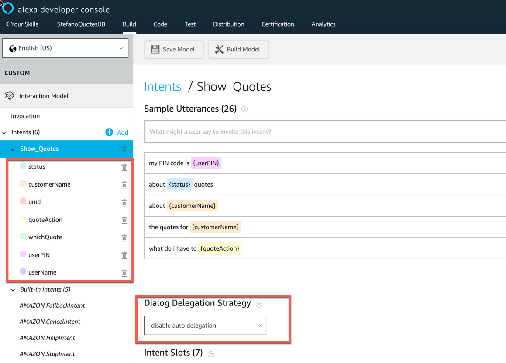
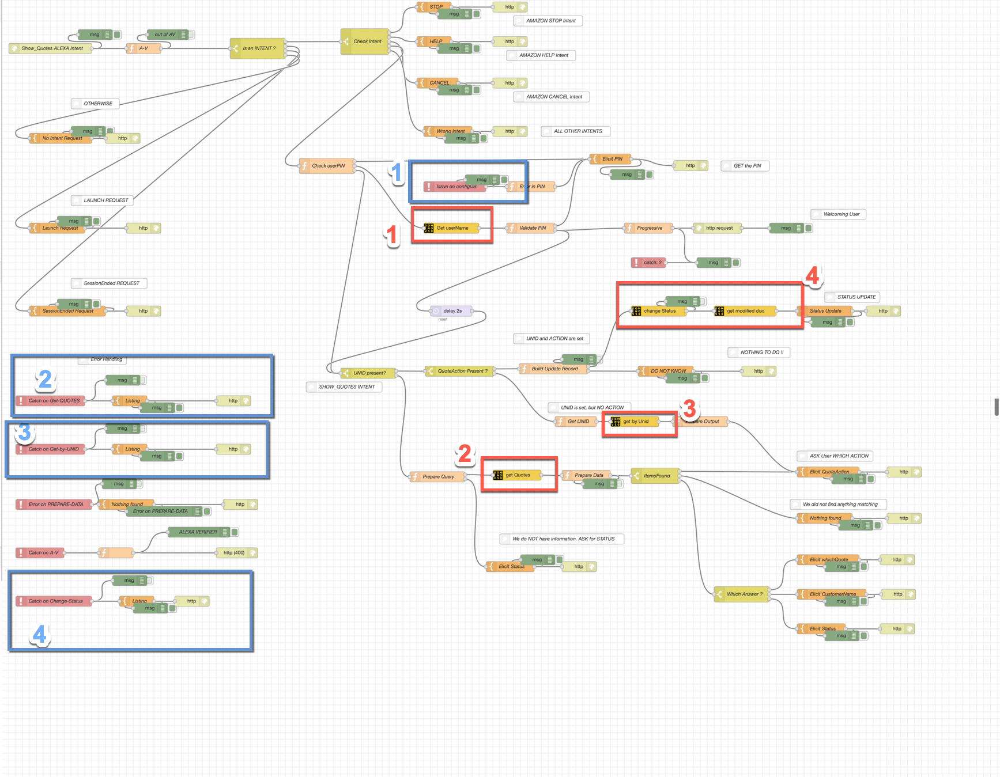
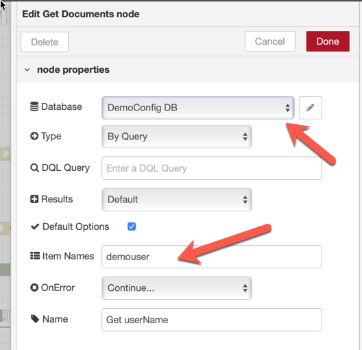
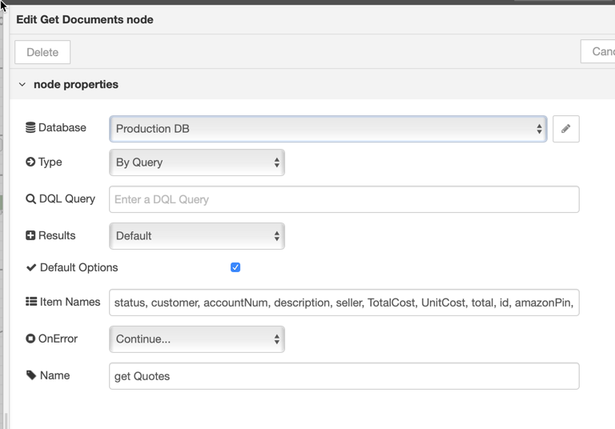
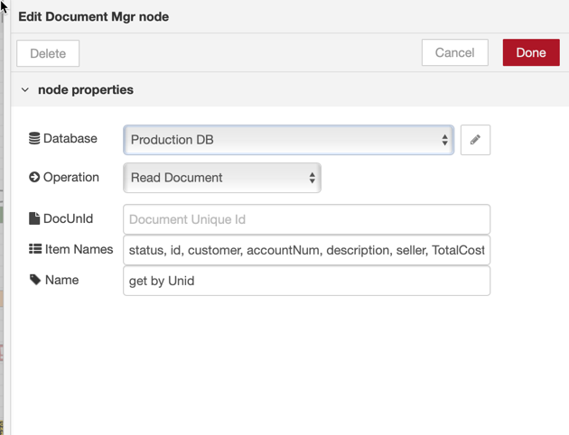
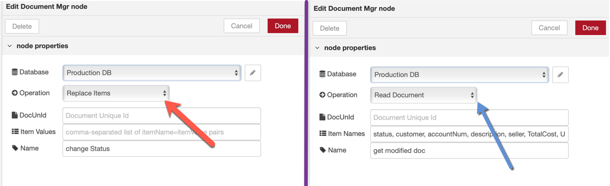

This page presents an overview of the integration one of the Amazon ALEXA Skills that has been shown during the **Think 2019 ICS Community Day** in February 2019.  
The goal in this section is **not** to drill into the complexity of the NodeRED flow implementing the server-side part of the Amazon ALEXA Skill but, rather, to show how the use of the <strong style="color: #FEC70B; background-color: black">NodeRED dominodb nodes</strong> has allowed us to create the flow with little or no knowdlege of the <strong style="color: #FEC70B; background-color: black">DOMINO</strong> databases (two of them) that were used to implement the skill.  

More details about the integration are provided in the other pages of this section.

<h2>The Implementation</h2>
The idea of the demo was to allow any person from the Toymakers Company to inquire the quotes she created and to modify their status. 

This integration is composed of two parts:
- The first part is the definition of the Amazon ALEXA Skill itself, which happens inside the Amazon ALEXA Developer Portal.
In order to give an idea, here is a screenshot of the Amazon ALEXA Skill definition:  

What is noticeable, here:
    - We defined few **Slots** to keep track of the actions performed by the Skill
    - We implemented the dialog completely within the NodeRED flow (**disabling auto-delegation**)
  
- the second part happens inside NodeRED and uses, among others, the <strong style="color: #FEC70B; background-color: black">NodeRED dominodb nodes</strong>.   The NodeRED flow managing this is shown in the picture below.  
  
We highlighted the <strong style="color: #FEC70B; background-color: black">NodeRED dominodb nodes</strong> instances that have been used using <strong style="color:red">the red pencil</strong> and the corresponding **catch nodes** using <strong style="color:blue">the blue pencil</strong>.

Let's drill in those highlighted sections:
1.  the **Get Username** node.  
  
This node is an instance of the **Get Documents** node which uses the **Configuration DB** <strong style="color: #FEC70B; background-color: black">DOMINO</strong> database node.  
It inquires the <strong style="color: #FEC70B; background-color: black">DOMINO</strong> database associated to the **Configuration DB** node using a **DQL query** (which comes as an input from a previous node) of this form:  
`msg.DDB_query = "amazonPIN = 1234"`  
and returns the `demouser` field from the database which contains the real name of the user.  
This query is used during the authentication of the Skill, when the Skill asks for the PIN code.  
In case the query fails, a proper **catch node** (identified within the <strong style="color:blue">#1 blue rectangle</strong>) is used which gracefully asks the user to re-enter her PIN code. It also verifies if the PIN is recognized.

1.  The **Get Quotes** node.
  
This node is an instance of the **Get Documents** node and uses the **Production DB** <strong style="color: #FEC70B; background-color: black">DOMINO</strong> database node.  
It inquires the **Production DB** using a query (which comes from a previous node) of this form:  
`msg.DDB_query = "status = 'pending' AND amazonPIN = 1234"`  
and returns the `status, customer, accountNum, description, seller, TotalCost, UnitCost, total, id, amazonPin` fields from the database.  
This query is used when the user has decided which kind of quotes she is looking at.  
In case the query fails, a proper **catch node** (identified within the <strong style="color:blue">#2 blue rectangle</strong>) is used which ends the Amazon ALEXA session.  

1. the **get by Unid** node.  
  
This node is an instance of the **DocumentMgr** node and uses the **Production DB** <strong style="color: #FEC70B; background-color: black">DOMINO</strong> database node.  
It inquires the **Production DB** using a `@unid` (which comes from a previous node) of this form:  
`msg.DDB_unid = "value"`  
and returns the `status, customer, accountNum, description, seller, TotalCost, UnitCost, total, id, amazonPin` fields from the database.  
This query is used when the user has decided which quote she wants to modify the status for.  
In case the query fails, a proper **catch node** (identified within the <strong style="color:blue">#3 blue rectangle</strong>) is used ends the Amazon ALEXA session.

1. The **Change Status** and **Get Modified Doc** nodes.  
  
These nodes are, both, instaces of the same **DocumentMgr** node and they both use the **Production DB** <strong style="color: #FEC70B; background-color: black">DOMINO</strong> database node.  
    1. The first (named **Change Status** ) performs a **Replace Items** operation (the <strong style="color:red">red arrow</strong>).  
    It uses the `msg.DDB_unid` and the `msg.DDB_itemValues` information which are passed from a previous node.
    2. the second (named **Get Modified Doc** ) performs a **Read Document** operation (the <strong style="color:blue">blue arrow</strong>) where it returns the `status, customer, accountNum, description, seller, TotalCost, UnitCost, total, id, amazonPin, $UpdatedBy, Comments, ActionDate, ApprovalType, Reviewer`fields from the mdofied document.  
    It uses the same  `msg.DDB_unid` information that the previous node used.
This set o two nodes is used when the user needs to commit the status change.  
In case any of the two operations fail, a proper **catch node** (identified within the <strong style="color:blue">#4 blue rectangle</strong>) is used ends the Amazon ALEXA session.

<h2>Conclusion</h2>
That was simple right ?  
In this example we proved that, using the <strong style="color: #FEC70B; background-color: black">DOMINO</strong> we could really concentrate on the task of properly implementing the server-side code of an Amazon ALEXA skill; the fact that we were interacting with one or more <strong style="color: #FEC70B; background-color: black">DOMINO</strong>  databases has been very much simplified by the use of the <strong style="color: #FEC70B; background-color: black">NodeRED dominodb nodes</strong> without worrying at all about the complexity of how to interact with the <strong style="color: #FEC70B; background-color: black">DOMINO</strong> engine.  

In the remaining part of this section, we provide the code associated with the **3 Amazon ALEXA Skills** that were presented during the **Think 2019 ICS Community Day** in February 2019. 

