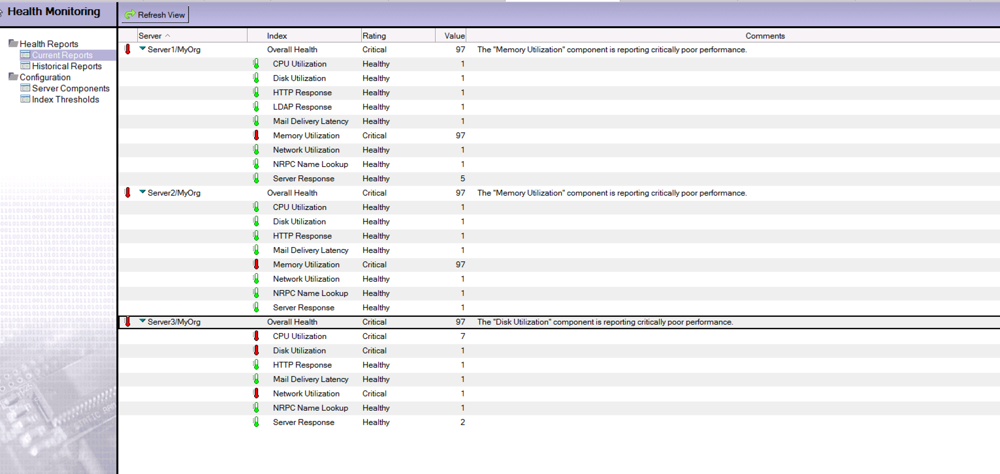
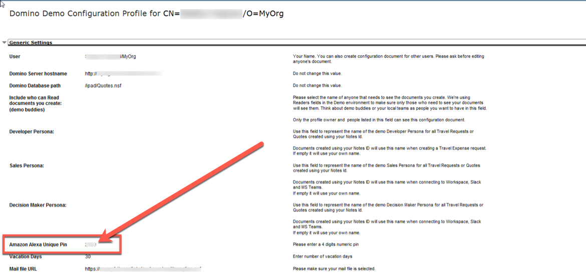
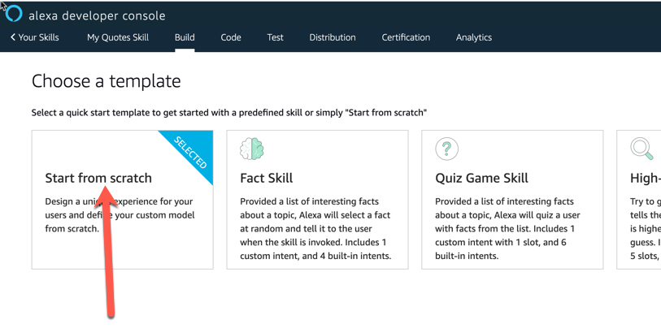

This page provides the details about the implementation of the **Amazon ALEXA Domino Monitor** Skill.  

<h2>Skill Description</h2>
The idea behind this skill is to allow a Domino Administrator to inquire the status of the services running on the Domino Cluster and to start, stop or restart any of them.  
The skill thus provides a voice interface to the `dommon.nsf` database, a screenshot of which is shown here below:

<h3>Typical Interaction model</h3>
The default invocation sentence for the skill is `domino servers`. 
-   The first thing that a user needs to do is to authenticate herself.  
    This can be done using sentences such as: `my Pin code is 1 2 3 4`, `my id is 1 2 3 4`, `I am 1 2 3 4`, `my Pin is 1 2 3 4`.  
    The important thing is that the code needs to be spelled as a 4 digit code.  
    The Skill validates the entered PIN Code against the **DemoConfig DB** and greets you by name (which it retrieved during the authentication)  

-   At this point you can check the status of your Domino Cluster.  
This can be done using sentences such as: `how are my servers`, `how are my domino servers doing`, `tell me the status of my servers` ...  
The Skill will list the names of the servers belonging to the Domino Cluster (monitored by the `dommon.nsf` database) and will ask you to chose for which of the servers you want to have details.  

-   You need to answer the **cardinal number** associated with the server (we suppose here that the server names are in the form `server1`, `server2`, `server3`etc.. the algorithm will then build the name of the server by concatenating the string `server`with the **cardinal number** you answered).  
The skill will answer something like the following:
`CPU Utilization, Server Response, Disk Utilization, Network Utilization, Mail Delivery Latency, NRPC Name Lookup, HTTP Response, LDAP Response are healthy. BUT Memory Utilization are in a critical state . What do you want to do?`  

-   You can ask `Tell me the score of Memory Utilization` and the skill will read it for you

-   You can now ask `Please restart NRPC Name Lookup`. The skill will answer it will perform the operation.  
Note: the operation will not be performed by this version. But you could extend it to deliver this functionality

- You end the conversation at any moment by saying `exit`.  
You can interrupt a conversation at any moment saying `cancel` 

<h3>Using the skill</h3>
Once everything is properly setup, you can interact with your skill using **any Amazon ALEXA enabled device**.  
The default invocation sentence for the skill is `domino servers`.  
On devices that are enabled to display the Amazon ALEXA Card, you can also enjoy a richer interface.

<h2>Pre-Requisites</h2>

1.  The implementation uses two <strong style="color: #FEC70B; background-color: black">NodeRED dominodb</strong> **Configuration Nodes**:
    1.  The First one, **Health Monitor DB**, refers to the <strong style="color: #FEC70B; background-color: black">DOMINO</strong> database which holds the health information about your <strong style="color: #FEC70B; background-color: black">DOMINO</strong> cluster.  
    It corresponds to the **standard** `dommon.nsf`Domino database
    1.  The Second One, **DemoConfig DB**, refers to the <strong style="color: #FEC70B; background-color: black">DOMINO</strong> database which helds the information about the  users of the Application.  
    It corresponds to the `DemoConfig.nsf`Domino database

    <strong style="color:red">Note :</strong>You need to have those two databases configured and operational in order for the **Amazon ALEXA DominoDB** Skill to properly work.  
    <strong style="color:red">Note :</strong>Please refer to the documentation for the Domino Quotes Application to retrieve the template of those two databases. 

2.  You need to have an **Amazon ALEXA Developer Account** in order to import the definition of the skill  

3.  You need to have a **NodeRED instance** that is reachable from the internet.  
Actually, it is the URL of this instance that will be required to fill the Endpoint property of the Amazon ALEXA Skill.  

4.  When installing and configuring your NodeRED instance, <strong style="color:red">do NOT FORGET</strong> to install the <strong style="color: #FEC70B; background-color: black">dominodb nodejs package</strong> [as detailed here](../info-intro/).  

5.  The NodeRED skill implementation makes a reference to a [Domino V10 logo](https://icstechsales.github.io/think2019lab-domino-integration/docs/images/dominoV10.png). This logo is retrieved from this site. Feel free to change the referene to a different image.

6.  In order for the flow to properly function, you need to remember to configure the `amazonPin` field in the **DemoConfig DB**. This **must be a 4 digit number** in order for the Amazon ALEXA Skill to properly process it.

<h2>The Amazon ALEXA Skill Definition</h2>
In **your Amazon ALEXA Developer Portal**, you need:

1.  to create a new Skill.
    1.  Give it a name and select Custom  
      

    1.  Do not choose any template. Instead Start from Scratch  
    

    1.  Once you arrive to the Build screen for your skill, go to the JSON Editor and import the Skill definition that is available [from this link](../downloads/Alexa-Think2019-Skill - Domino Monitor.json)
    

    1.  Do not forget to Save the model.

2.  Once you have imported the Skill definition in **your Amazon ALEXA Developer Portal**, you need to configure the endpoint as shown here:
    

    <strong style="color:red">Do not forget</strong> 
    1.  to enter the URL corresponding to your NodeRED running instance where the text is blurred in the picture above.
    2.  Also add the `/serverStatus` string at the end of the URL as the NodeRED flow would expect to receive the inputs from Amazon ALEXA at that very endpoint.

<h2>The NodeRED Flow Definition</h2>
You need to import the relevant NodeRED flow into your NodeRED instance. You can use the [export flow available here](../downloads/Alexa-Think2019-NodeRed - Domino Monitor.json).  
We suggest to import it in its own tab. The end result would be something like this:

