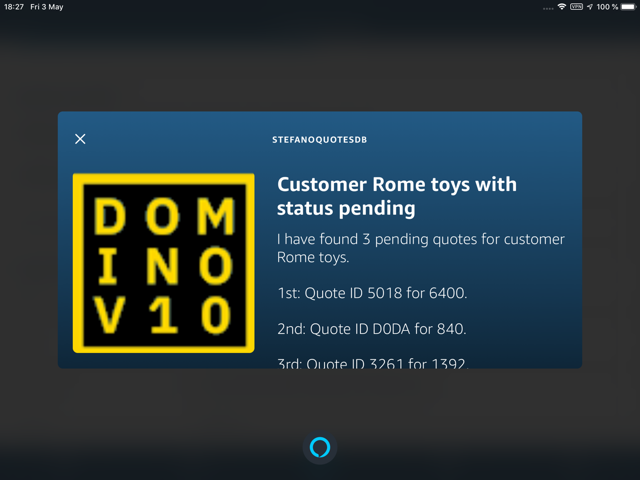
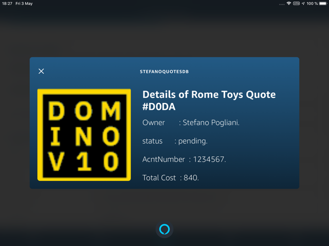
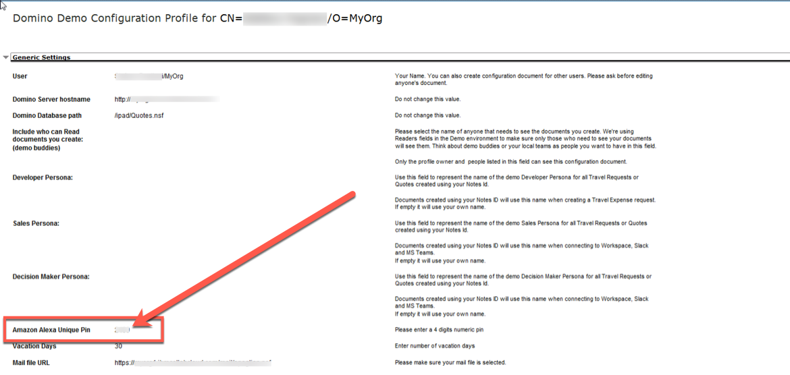
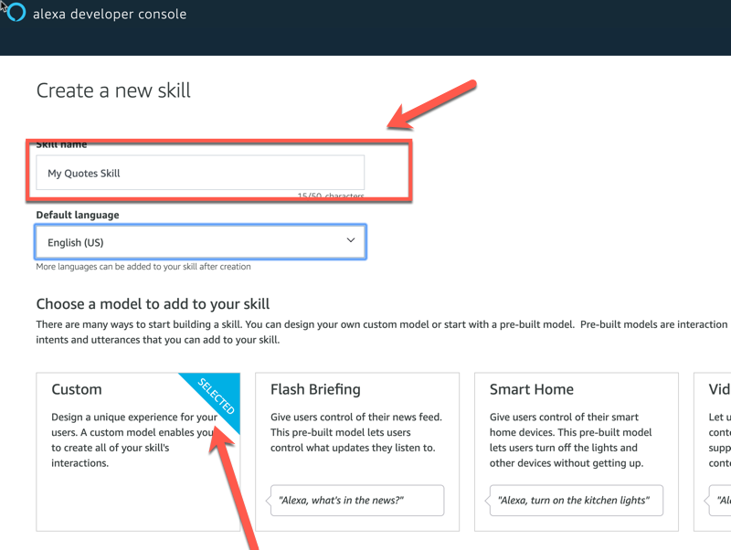
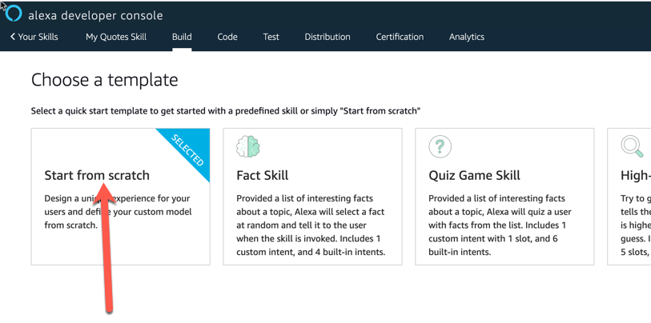
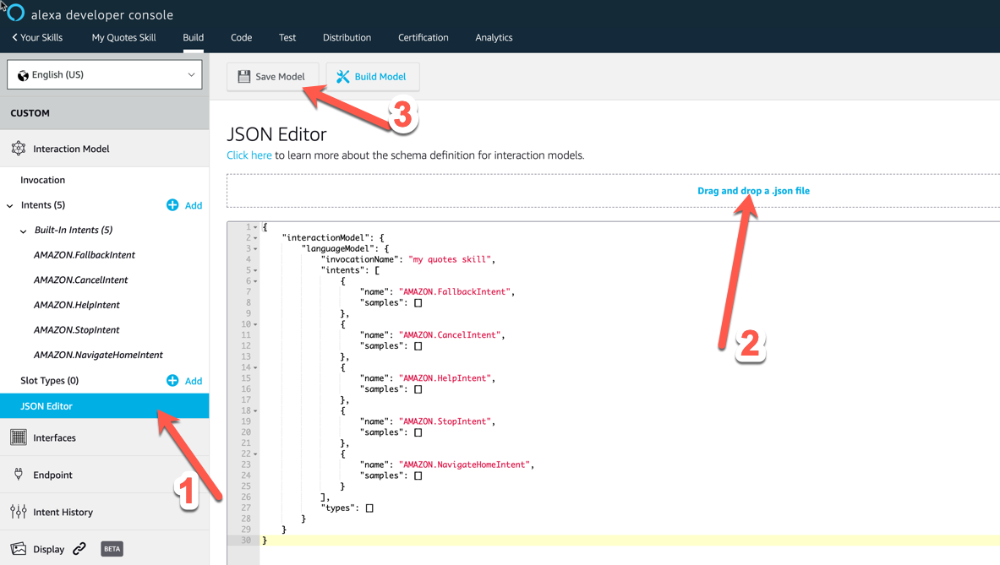
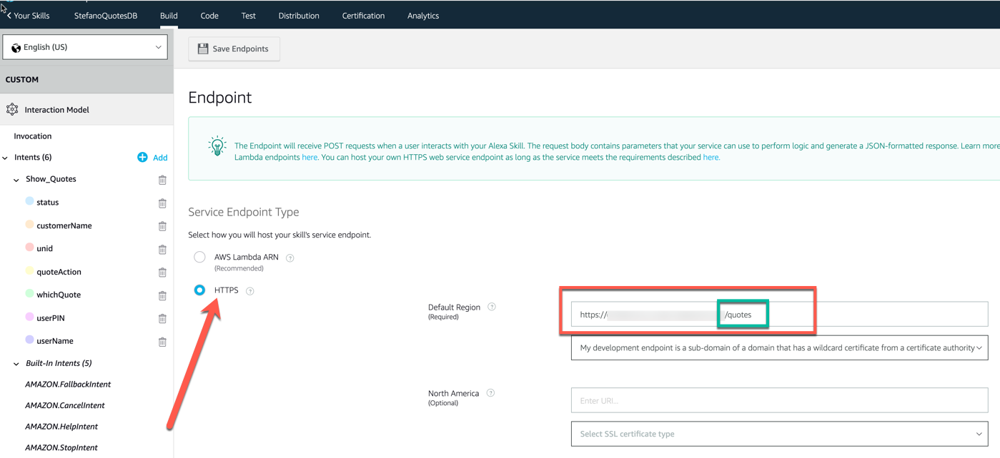
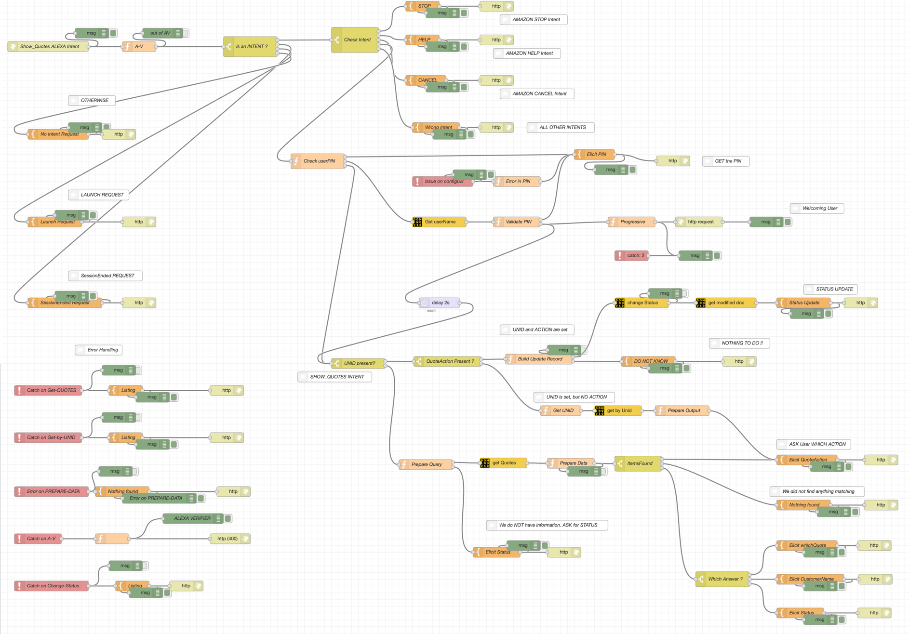

This page provides the details about the implementation of the **Amazon ALEXA QuotesDB** Skill.  

<h2>Skill Description</h2>
The idea behind this skill is to allow any person from the Toymakers Company to inquire the quotes she created and to modify their status (approved, rejected or pending).

<h3>Typical Interaction model</h3>
The default invocation sentence for the skill is `sales quotes`. 
-   The first thing that a user needs to do is to authenticate herself.  
    This can be done using sentences such as: `my Pin code is 1 2 3 4`, `my id is 1 2 3 4`, `I am 1 2 3 4`, `my Pin is 1 2 3 4`.  
    The important thing is that the code needs to be spelled as a 4 digit code.  
    The Skill validates the entered PIN Code against the **DemoConfig DB** and greets you by name (which it retrieved during the authentication)  

-   At this point you can start the conversation in different ways:
    -   You can access your quotes by asking to list them by status (`pending`, `approved`, `rejected`). You can use sentences such as: `show my pending quotes`, `give me approved quotes`, `which are my rejected quotes`, `give my pending quotes`, `what do I need to approve`, `what do I have to reject` etc.  
    In case results are found:
        - Alexa groups the found quotes by customerName in case the result set includes quotes for different customers.  
        You are asked to provide the name of the customer.  
        Alexa lists the quotes for that customer in case there are more than one and asks you to choose the one you want to modify. You will respond with an ordinal number (such as: `first`, `fourth` etc).  
        Alexa shows the details of the chosen quote and asks you what operation do you want to do: `approve`, `reject`or `reset to pending`
        - If quotes are found for a single customer, Alexa lists the quotes for that customer in case there is more than one and asks you to choose the one you want to modify. You will respond with an ordinal number (such as: `first`, `fourth` etc).  
        Alexa shows the details of the chosen quote and asks you what operation do you want to do: `approve`, `reject`or `reset to pending`
        - if only one quote is retrieved, Alexa shows the details of the chosen quote and asks you what operation do you want to do: `approve`, `reject`or `reset to pending`   

    - You can access your quotes by asking to list them by customerName. You can use sentences such as: `what about Miami Toys`, `give me the quotes for Chicago Toys`, `show me the quotes for Philadelphia Toys`...
    In case results are found:
        - Alexa groups the found quotes by status in case the result set includes quotes with different statuses.  
        You are asked to provide the status you want to drill into (`approved`, `pending`or `rejected`).  
        Alexa lists the quotes in that status in case there are more than one and asks you to choose the one you want to modify. You will respond with an ordinal number (such as: `first`, `fourth` etc).  
        Alexa shows the details of the chosen quote and asks you what operation do you want to do: `approve`, `reject`or `reset to pending`
        - If quotes are found which are all in the same status, Alexa lists the quotes in that status in case there is more than one and asks you to choose the one you want to modify. You will respond with an ordinal number (such as: `first`, `fourth` etc).  
        Alexa shows the details of the chosen quote and asks you what operation do you want to do: `approve`, `reject`or `reset to pending`
        - if only one quote is retrieved, Alexa shows the details of the chosen quote and asks you what operation do you want to do: `approve`, `reject`or `reset to pending`  

    - You end the conversation at any moment by saying `exit`.  
    You can interrupt a conversation at any moment saying `cancel`

    - If you do not end the conversation once you have approved, rejected or reset to pending a given quote, Alexa remembers your authentication and does not asks it again.  

    - There is some bug. Know ones are:
      - if you start the conversation by customerName, you need to authenticate again even if you already did
      - if you try to interrupt a conversation when Alexa asks for a customerName, it does not understand...

<h3>Using the skill</h3>
Once everything is properly setup, you can interact with your skill using **any Amazon ALEXA enabled device**.  
The default invocation sentence for the skill is `sales quotes`.  
On devices that are enabled to display the Amazon ALEXA Card, you can also enjoy a richer interface such as the one shown in the following images:

<h2>Pre-Requisites</h2>

1.  The implementation uses two <strong style="color: #FEC70B; background-color: black">NodeRED dominodb</strong> **Configuration Nodes**:
    1.  The First one, **Prooduction DB**, refers to the <strong style="color: #FEC70B; background-color: black">DOMINO</strong> database which holds the Quotes.  
        It corresponds to the `Quotes.nsf`Domino database
    2.  The Second One, **DemoConfig DB**, refers to the <strong style="color: #FEC70B; background-color: black">DOMINO</strong> database which helds the information about the  users of the Application.  
        It corresponds to the `DemoConfig.nsf`Domino database

    <strong style="color:red">Note :</strong>You need to have those two databases configured and operational in order for the **Amazon ALEXA DominoDB** Skill to properly work.  
    <strong style="color:red">Note :</strong>Please refer to the documentation for the Domino Quotes Application to retrieve the template of those two databases. 

2.  You need to have an **Amazon ALEXA Developer Account** in order to import the definition of the skill  

3.  You need to have a **NodeRED instance** that is reachable from the internet.  
Actually, it is the URL of this instance that will be required to fill the Endpoint property of the Amazon ALEXA Skill.  

4.  When installing and configuring your NodeRED instance, <strong style="color:red">do NOT FORGET</strong> to install the <strong style="color: #FEC70B; background-color: black">dominodb nodejs package</strong> [as detailed here](../info-intro/).  

5.  The NodeRED skill implementation makes a reference to a [Domino V10 logo](https://icstechsales.github.io/think2019lab-domino-integration/docs/images/dominoV10.png). This logo is retrieved from this site. Feel free to change the referene to a different image.

6.  In order for the flow to properly function, you need to remember to configure the `amazonPin` field in the **DemoConfig DB**. This **must be a 4 digit number** in order for the Amazon ALEXA Skill to properly process it.

<h2>The Amazon ALEXA Skill Definition</h2>
In **your Amazon ALEXA Developer Portal**, you need:

1.  to create a new Skill.
    1.  Give it a name and select Custom  
      

    2.  Do not choose any template. Instead Start from Scratch  
    

    3.  Once you arrive to the Build screen for your skill, go to the JSON Editor and import the Skill definition that is available [from this link](../downloads/Alexa-Think2019-Skill - Quotes App.json)
    

    4.  Do not forget to Save the model.

2.  Once you have imported the Skill definition in **your Amazon ALEXA Developer Portal**, you need to configure the endpoint as shown here:
    

    <strong style="color:red">Do not forget</strong> 
    1.  to enter the URL corresponding to your NodeRED running instance where the text is blurred in the picture above.
    2.  Also add the `/quotes` string at the end of the URL as the NodeRED flow would expect to receive the inputs from Amazon ALEXA at that very endpoint.

<h2>The NodeRED Flow Definition</h2>
You need to import the relevant NodeRED flow into your NodeRED instance. You can use the [export flow available here](../downloads/Alexa-Think2019-NodeRed - Quotes App.json).  
We suggest to import it in its own tab. The end result would be something like this:

