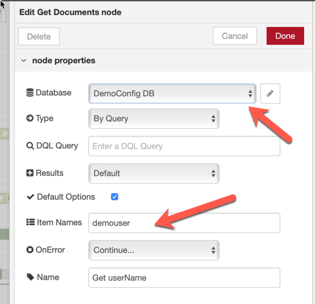
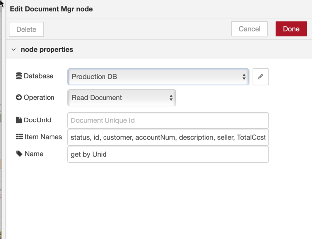

This page describes the integration one of the Amazon ALEXA Skills that has been shown during the **Think 2019 ICS Community Day** in February 2019.  
The goal in this section is **not** to drill into the complexity of the NodeRED flow implementing the server-side of the ALEXA Skill but, rather, to show how the use of the <strong style="color: #FEC70B; background-color: black">NodeRED dominodb nodes</strong> has allowed us to create the flow with little or no knowdlege of the <strong style="color: #FEC70B; background-color: black">DOMINO</strong> databases (two of them) rthat were used to implement the skill.

<h2>The Implementation</h2>
The idea of the demo was to allow any person from the Toymakers Company to inquire the quotes she created and to modify their status. 

This integration is composed of two parts:
- the first part is the definition of the ALEXA Skill itself, which happens inside the ALEXA Developer Portal.  
In order to give an idea, here is a screenshot of the ALEXA Skill definition:  
  
What is noticeable, here:
    - We defined few **Slots** to keep track of the actions performed by the Skill
    - We implemented the dialog completely within the NodeRED flow (disabling auto-delegation)
- the second part happens inside NodeRED and uses, among others, the <strong style="color: #FEC70B; background-color: black">NodeRED dominodb nodes</strong>.   The NodeRED flow managing this is shown in the picture below.  
  
We highlighted the <strong style="color: #FEC70B; background-color: black">NodeRED dominodb nodes</strong> instances that have been used using <strong style="color:red">the red pencil</strong> and the corresponding **catch nodes** using <strong style="color:blue">the blue pencil</strong>.

Let's drill in those highlighted sections:
1.  the **Get Username** node.  
  
This node is an instance of the **Get Documents** node and uses the **Configuration DB** <strong style="color: #FEC70B; background-color: black">DOMINO</strong> database.  
It inquires the **Configuration DB** using a query (which comes from a previous node) of this form ``msg.DDB_query = "amazonPIN = 1234"` and returns the `demouser` field from the database which contains the real name of the user. **amazonPIN** is an Alexa Slot.
This query is used during the authentication of the Skill, when the Skill asks for the PIN code.  
In case the query fails, a proper **catch node** is used which gracefully asks the user to re-enter her PIN code. It also verifies if the PIN is recognized.

2.  The **Get Quotes** node.
  
This node is an instance of the **Get Documents** node and uses the **Production DB** <strong style="color: #FEC70B; background-color: black">DOMINO</strong> database.  
It inquires the **Production DB** using a query (which comes from a previous node) of this form ``msg.DDB_query = "status = 'pending' AND amazonPIN = 1234"` and returns the `status, customer, accountNum, description, seller, TotalCost, UnitCost, total, id, amazonPin` fields from the database.  
This query is used when the user has decided which kind of quotes she is looking at. **whcihAction** is the Alexa slot that is used.
In case the query fails, a proper **catch node** is used ends the Alexa session.

3. the **get by Unid** node.  
  
This node is an instance of the **DocumentMgr** node and uses the **Production DB** <strong style="color: #FEC70B; background-color: black">DOMINO</strong> database.  
It inquires the **Production DB** using a `@unid` (which comes from a previous node) of this form ``msg.DDB_unid = "value"` and returns the `status, customer, accountNum, description, seller, TotalCost, UnitCost, total, id, amazonPin` fields from the database.  
This query is used when the user has decided which quote she wants to modify the status for . **unid** is the Alexa slot that is used.
In case the query fails, a proper **catch node** is used ends the Alexa session.

4. The **Change Status** and **Get Modified Doc** nodes.  
  
These nodes are, both, instaces of the **DocumentMgr** node. The first performs a **Replace Items** operation (the <strong style="color:red">red arrow</strong>) and the second a **Red Document** operation (the <strong style="color:blue">blue arrow</strong>) where it returns the `status, customer, accountNum, description, seller, TotalCost, UnitCost, total, id, amazonPin, $UpdatedBy, Comments, ActionDate, ApprovalType, Reviewer`fields from the mdofied document.  
The `msg.DDB_unid` and the `msg.DDB_itemValues` information are passed to the **Change Status** node; the `msg.DDB_unid`information (passed through the **Change Status** node) also arrives to the **Get Modified Doc** node.  
This query is used when the user has commits the status change . **unid** is the Alexa slot that is used.
In case the query fails, a proper **catch node** is used ends the Alexa session.

<h2>Conclusion</h2>
That was simple right ?  
What we proved in this example was that we could really concentrate on the task of properly responding to an incoming request from Alexa; the fact that we were interacting with <strong style="color: #FEC70B; background-color: black">DOMINO</strong>  has been very much simplified by the use of two cascading <strong style="color: #FEC70B; background-color: black">NodeRED dominodb nodes</strong> without worrying at all about the complexity of how it was implemented.  

