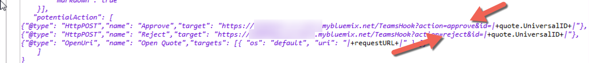

This page describes the integration with Microsoft Teams that has been shown during the **DOMINO 10 Launch event** in October 2018. 

The idea of the demo was that, once a new ToyMakers Quote was created, an event was generated for Microsoft Teams; the event was represented by an **actionable event** appearing in a Teams space which allowed the user to either Accept or Reject the Quote.

This integration is composed of two parts:
- the first part happens <strong style="color: #FEC70B; background-color: black">inside DOMINO</strong> and is implemented via an Agent developed in Lotusscript.  
It corresponds to the part of the processing which triggers the event for the target platform (in this case Microsft Teams) informing about the New Quote that has been created in Domino
- the second part happens <strong style="color: #FEC70B; background-color: black">outside DOMINO</strong> . It corresponds to the implementation of the implementation of the **action** (the Approve or Reject action) from the target platform (Microsoft Teams).

The NodeRED flow managing the **second part of the integration** is shown in the picture below.  

Let's analyze the details:
- At first, we created a listener hook in NodeRED via an **HTTP in node**.  
This node listens for **HTTP POST** requests coming from Microsoft Teams when the user hits the *Accept* or *Reject* buttons. The endpoint **TeamsHook** has been defined by the LotusScript agent as shown here : 

Note that we also added a **Debug Node** which dumps the whole POST request coming from Teams

- Then we added a Function Node (**GetAction and UNID**) which is meant to validate that the POST Request is bringing the *Accept* or the *Reject* actions as defined by the LotusScript agent:
  
The Body of the Function Node is very simple :
  
    - The node has two outputs (as shown by the <strong style="color:red">red rectangle</strong>): the first to lead to the part of the flow dealing with Approving/Rejecting (the <strong style="color:red">red arrows</strong>) and the second to deal with not valid input parameters (<strong style="color:blue">blue arrows</strong>).
        - The first output is going to *two different nodes**, the **update Domino record** and the **Build Results** nodes.   The reason is that we need to preserve the incoming HTTP request context in order to properly respond to Teams using the **HTPP Response** node. Such context may be lost trhough the use of the **uodate Domino record** node (and the following ones).
            - Normally, the <strong style="color: #FEC70B; background-color: black">NodeRED dominodb nodes</strong> do not loose the context, but this trick ensures that, in case you may use other types of nodes, then you will not be lost
    - if the input is validated, it constructs the proper `msg.DDB_itemValues` attribute that will be passed to the following **Update Domino Record** node. In this way, the **Update Domino Record** knows how to modify the `status` field.   It also sets the `msg.DDB_unid` attribute with the **@unid** value for the document to be modified. 
        - Note that these information come from the incoming POST request via the **action** and the **id** query parameters.

- 
- Before entering the behavior of the two <strong style="color: #FEC70B; background-color: black">NodeRED dominodb nodes</strong>, we need to undesratnd how those nodes will target the correct Domino database we are going to use,  
The two nodes use the same **NodeRED Credentials node** whose name is **Production DB** and whose definition is shown here below:  
  
In addition to the **name** of the Domino server, the **port** on which the **Proton component** listens to the APIs and the **name and location** of the Domino database, we also defined the <strong style="color:red">certificates</strong> that our **Proton component** uses.  
This is all done graphically from the **Database NodeRED Credentials node** which is included in the <strong style="color: #FEC70B; background-color: black">NodeRED dominodb</strong> package.

- Entering the **update Domino record** node.  
  
This is an instance of the **DocumentMgr** node which will execute the **Replace Items** API.  
The target document, not specified in the node Configuration Panel, comes from the `msg.DDB_unid` input parameter. Also, the new settings for the `status`attribute come from the incoming `msg.DDB_itemValues` input parameter.

- The **Read Domino Record** node.
  
This is an instance of the **DocumentMgr** node which will execute the **Read Document** API.  
The target document, not specified in the node Configuration Panel, comes from the `msg.DDB_unid` input parameter (which is passed untouched by the previous **update Domino Record** node).   The node will provide, as output, the value for the `status, customer, description, total`attributes as specified by the Configuration panel

- The **Build Result** node.
  
This Function node is the destination of two inputs:
    - The first comes directly from the **Get Action and Unid** node. 
    - The second from the **Read Domino record** node.  We used the **NodeRED context** object to keep track of the two inputs (**NOTE:** This is far from a perfect implementation of the behavior. It is just a minimal implementation that worked for the demo. In a production context you certainly need to make the bahvior of the node more robust and resilient.)
    
    The input from the **Get Action and Unid** node is managed by the code in the <strong style="color:blue">blue rectangle</strong>. We save the whole incoming `msg` object in the **context** giving it an identifier which reflects the `@unid` value of the Domino record.  
    The input from the **Read Domino record** is managed by the code in the <strong style="color:red">red rectangle</strong>. It takes the `msg` object previously saved in the **context**, defines an output string for Microsoft Teams using the output values from the **Read Domino record** node (via the `msg.DDB_doc` output of that node) and returns that string as `payload` for the following node.

- The **Answer to Teams** node.   This is an instance of a **NodeRED HTTP Response** node which returns a response to the initial **HTTP-in node**.  This is the main reason we saved the original `msg`coming from the initial **HTTP-in node** and we re-used it in the **Build Result** node (simply adding a new payload).

That was simple right ?  
What we proved in this example was that we could really concentrate on the task of properly responding to an incoming request from Microsoft Teams; the fact that we were interacting with <strong style="color: #FEC70B; background-color: black">DOMINO</strong>  has been very much simplified by the use of two cascading <strong style="color: #FEC70B; background-color: black">NodeRED dominodb nodes</strong> without worrying at all about the complexity of how it was implemented.

